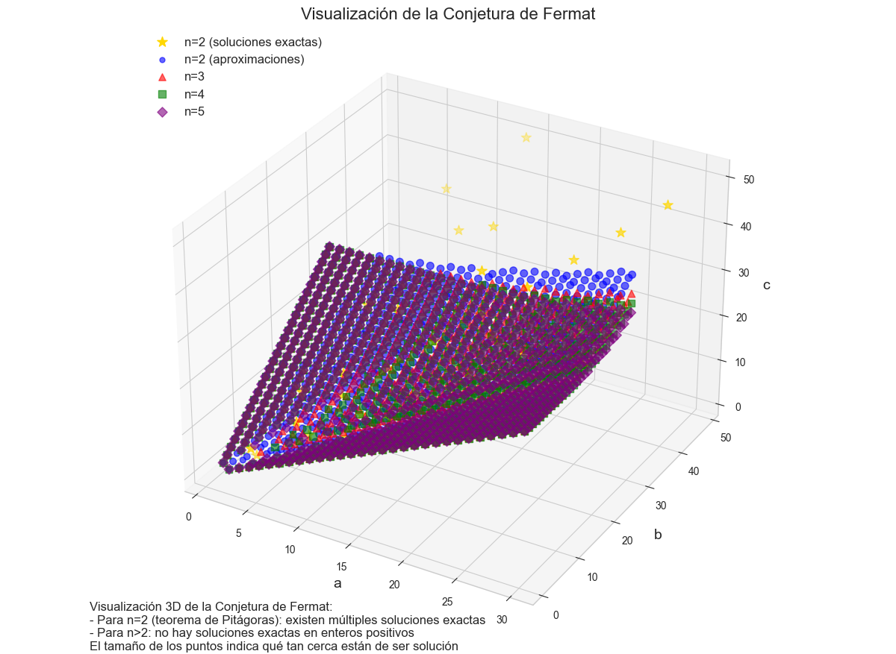
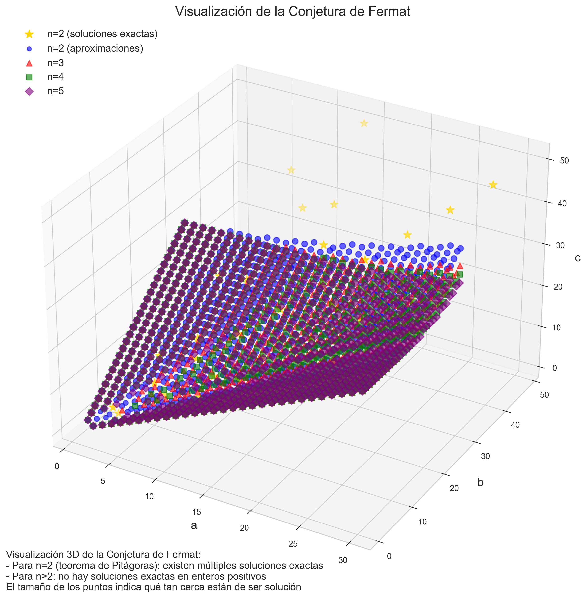
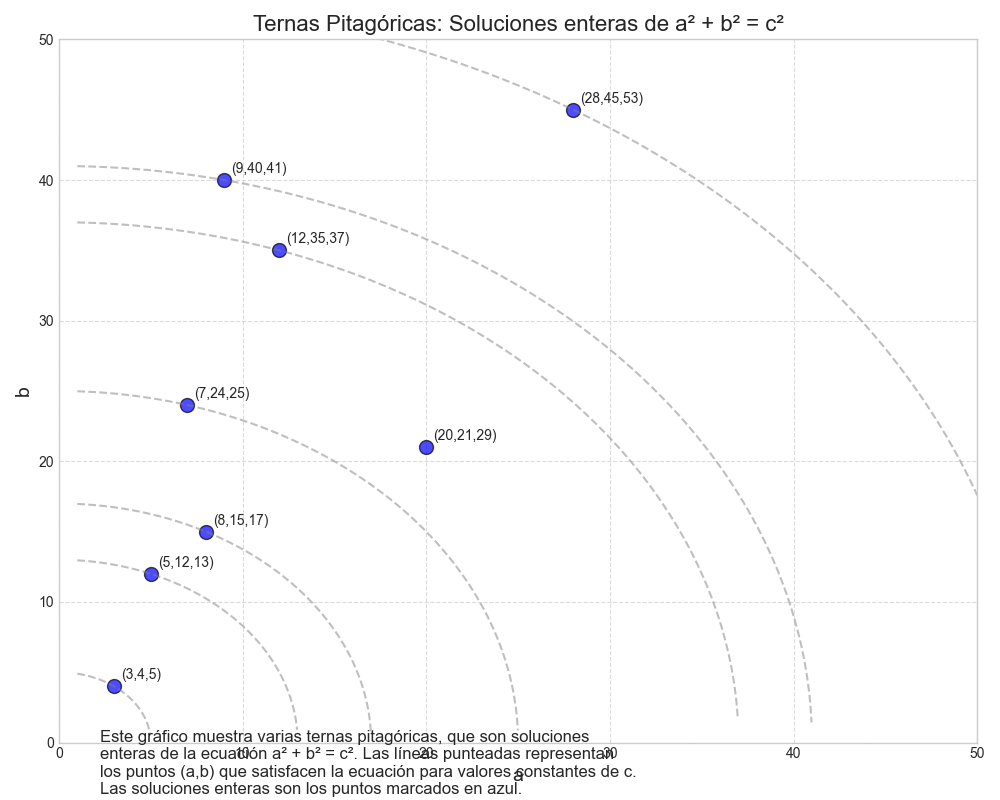
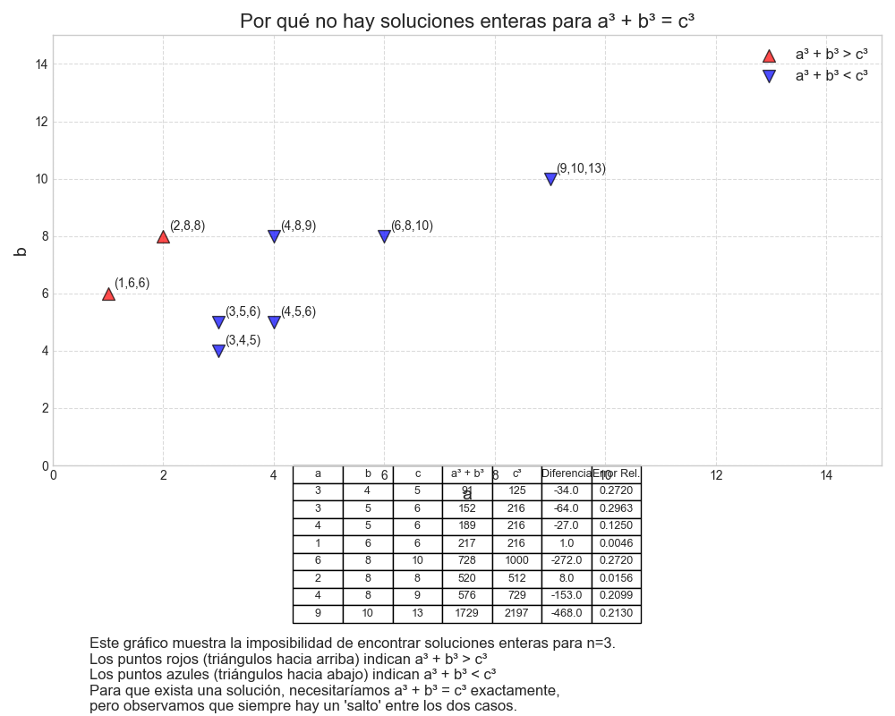
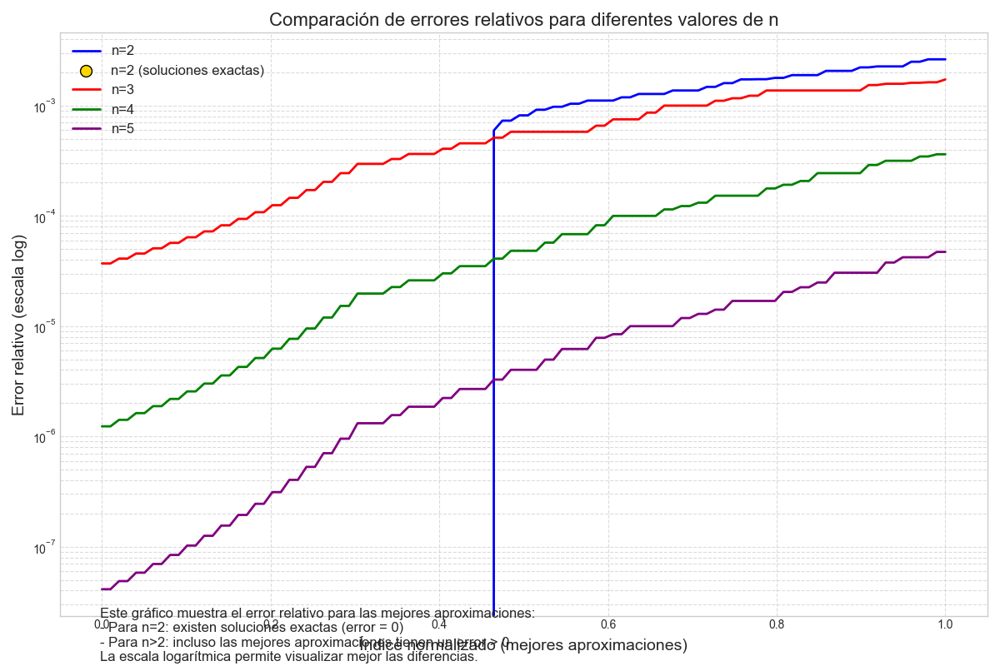

# Visualización de la Última Conjetura de Fermat

Este proyecto proporciona una visualización en 3D de la Última Conjetura de Fermat, que establece que la ecuación:

```
a^n + b^n = c^n
```

No tiene soluciones en enteros positivos cuando n > 2.

<div align="center">
  
</div>

## Objetivo

Visualizar gráficamente por qué la conjetura es verdadera, mostrando que:
- Para n = 2 (teorema de Pitágoras), existen múltiples soluciones enteras
- Para n > 2, no hay soluciones exactas en enteros positivos, pero podemos encontrar valores que se aproximan

## Visualizaciones

El proyecto genera tres tipos de visualizaciones interactivas:

### 1. Visualización 3D de puntos (a, b, c)

Muestra las combinaciones que satisfacen o se aproximan a la ecuación para distintos valores de n.

<div align="center">
  
</div>

### 2. Ternas Pitagóricas (n=2)

Para n=2, existen soluciones exactas conocidas como ternas pitagóricas.

<div align="center">
  
</div>

### 3. Ausencia de Soluciones para n>2

Visualizamos por qué no existen soluciones enteras cuando n>2.

<div align="center">
  2" width="70%">
</div>

### 4. Comparación de Errores

Compara qué tan cerca están las mejores aproximaciones para diferentes valores de n.

<div align="center">
  
</div>

## Tecnologías Utilizadas

<div align="center">
  <table>
    <tr>
      <td align="center" width="120">
        
        <br>Python 3
      </td>
      <td align="center" width="120">
        
        <br>NumPy
      </td>
      <td align="center" width="120">
        
        <br>Pandas
      </td>
      <td align="center" width="120">
        
        <br>Matplotlib
      </td>
      <td align="center" width="120">
        
        <br>Plotly
      </td>
    </tr>
  </table>
</div>

## Estructura del Proyecto

- `fermat_visualization.py`: Script principal para generar la visualización
- `fermat_utils.py`: Funciones auxiliares para cálculos relacionados con la conjetura
- `fermat_explanation.py`: Módulo educativo con explicaciones detalladas
- `run_fermat_project.py`: Script interactivo con menú de opciones
- `run.sh`: Script de inicialización automática del entorno
- `requirements.txt`: Dependencias del proyecto
- `img/`: Carpeta con imágenes de las visualizaciones

## Instalación y Uso

### Método Automático

Para instalar y ejecutar automáticamente:

```bash
chmod +x run.sh
./run.sh
```

### Método Manual

1. Crear entorno virtual: `python -m venv fermat_venv`
2. Activar entorno: 
   - Linux/Mac: `source fermat_venv/bin/activate`
   - Windows: `fermat_venv\Scripts\activate`
3. Instalar dependencias: `pip install -r requirements.txt`
4. Ejecutar: `python run_fermat_project.py`

## Resultados

La visualización demuestra claramente que:
- Para n=2: existen infinitas soluciones enteras (ternas pitagóricas)
- Para n>2: no hay soluciones enteras, pero encontramos puntos que se aproximan

## Autor

Desarrollado por [@686f6c61](https://github.com/686f6c61) 