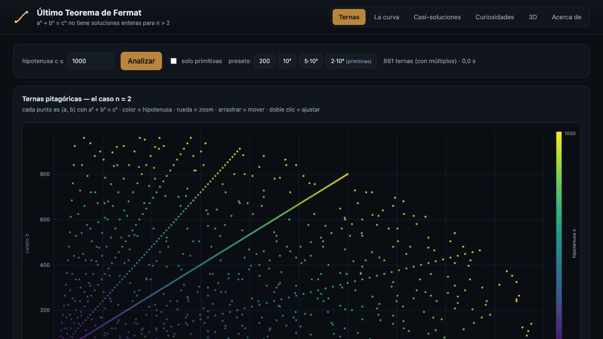
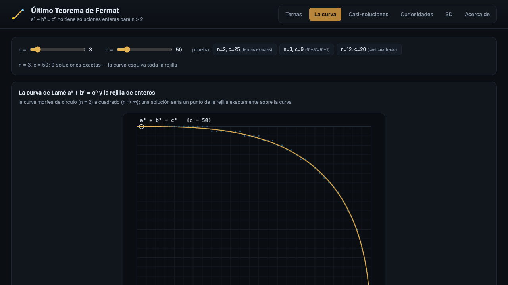
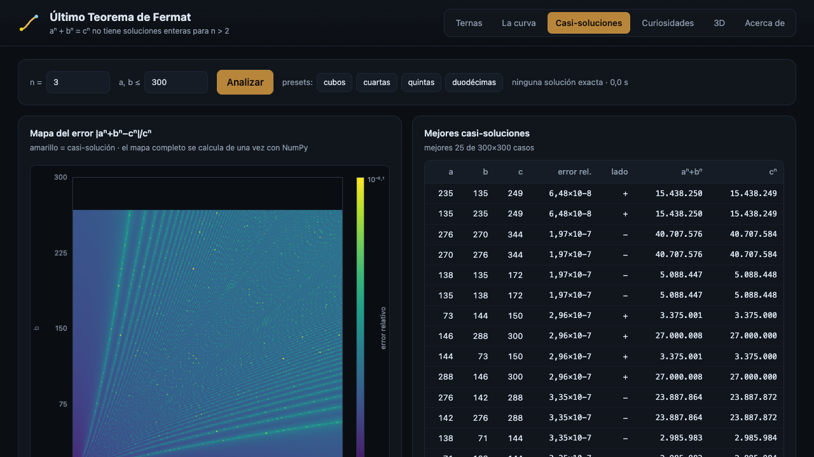
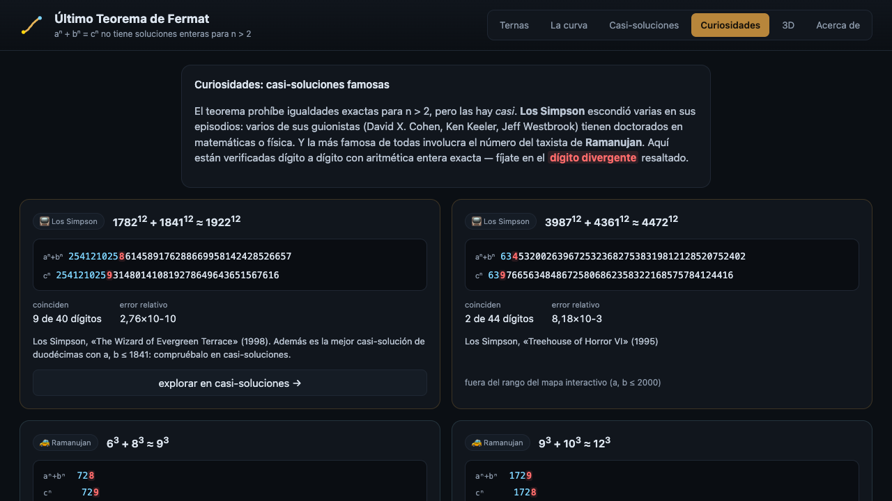
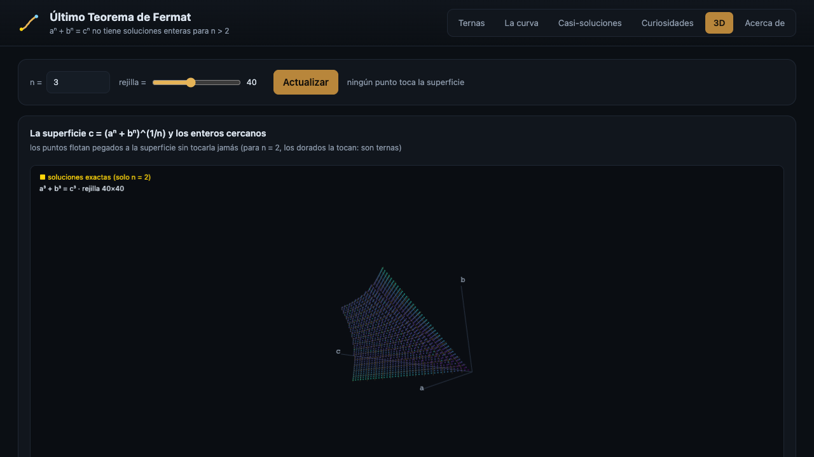

# Último Teorema de Fermat — explorador interactivo

Aplicación web para explorar el [Último Teorema de Fermat](https://en.wikipedia.org/wiki/Fermat%27s_Last_Theorem):
la ecuación aⁿ + bⁿ = cⁿ no tiene soluciones en enteros positivos para n > 2.



## Vistas

### Ternas — el caso n = 2

Todas las ternas pitagóricas hasta una hipotenusa dada, generadas con la
parametrización de Euclides (a = m²−n², b = 2mn, c = m²+n²) y coloreadas por
hipotenusa. Los múltiplos de cada terna primitiva forman el abanico de rayos
característico — una estructura que solo existe para n = 2. Zoom, pan y
tooltip sobre cientos de miles de puntos.

### La curva — por qué no hay soluciones



La curva de Lamé aⁿ + bⁿ = cⁿ morfea de circunferencia (n = 2) a cuadrado
(n → ∞) sobre la rejilla de enteros. Una solución sería un punto de la rejilla
exactamente sobre la curva: para n = 2 la circunferencia pasa por las ternas
(marcadas en dorado); para n > 2 la curva se cuela entre los puntos. El hueco
de cada columna se calcula con aritmética entera exacta.

### Casi-soluciones



Mapa de calor del error relativo |aⁿ+bⁿ−cⁿ|/cⁿ sobre toda la rejilla (a, b),
calculado de una vez con NumPy, más la tabla de las mejores casi-soluciones
**re-verificadas con enteros de precisión arbitraria** (el ranking flotante
solo preselecciona). Con n grande el mapa satura por debajo de ~10⁻¹³ — límite
de float64 — pero la tabla es exacta. Se exige c > max(a, b), como exige la
propia ecuación.

### Curiosidades — Simpson y Ramanujan



Las casi-soluciones famosas, verificadas dígito a dígito con enteros exactos:

- **1782¹² + 1841¹² ≈ 1922¹²** — la de la pizarra de Homer en
  «The Wizard of Evergreen Terrace»: coincide en 9 de 40 dígitos. Y sí: es la
  *mejor* casi-solución de duodécimas con a, b ≤ 1841 (compruébalo con el
  botón «explorar»).
- **9³ + 10³ = 12³ + 1** — el número del taxista de Ramanujan: 1729 es el
  menor entero que es suma de dos cubos de dos maneras distintas
  (1³ + 12³ = 9³ + 10³), y su segunda descomposición roza 12³.
- **64³ + 94³ = 103³ + 1**, 6³ + 8³ = 9³ − 1 …

### 3D



La superficie c = (aⁿ + bⁿ)^(1/n) en alambre con los enteros más cercanos
flotando alrededor, en un motor 3D propio en canvas: arrastrar rota, la rueda
hace zoom. Para n = 2 los puntos dorados (ternas) tocan la superficie; para
n > 3 nadie la toca.

## Algoritmos

| | |
|---|---|
| Ternas | Parametrización de Euclides vectorizada: O(√L · L) frente al triple bucle bruto |
| Mapa de casi-soluciones | Rejilla completa (a, b) en una pasada NumPy: 1841×1841 en ~100 ms |
| Ranking | Preselección flotante + re-verificación exacta con enteros de Python (sin límite de dígitos) |
| Hueco de la curva | floor/ceil evaluados con enteros exactos para cada columna |
| Transporte | Columnas binarias (base64 de arrays tipados) en lugar de JSON verboso |

## Instalación y uso

Requiere Python 3.10+.

```bash
pip install -e .        # o: pip install fastapi uvicorn numpy
python main.py          # sirve la app en http://127.0.0.1:8000
```

### API

```
GET /api/triples?limit=1000&primitive=false   # ternas pitagóricas
GET /api/near?n=3&amax=300                    # mapa y top de casi-soluciones
GET /api/lame?n=3&c=50                        # rejilla bajo la curva de Lamé
GET /api/curiosities                          # Simpson, Ramanujan…
GET /api/cloud?n=3&m=40                       # nube 3D
```

Documentación interactiva en `/docs` (OpenAPI/Swagger).

## Desarrollo

```bash
pip install -e .[dev]
pytest                # tests del núcleo y de la API
ruff check .          # lint
ruff format .         # formato
```

## Historia

Fermat anotó la afirmación en 1637 en el margen de su *Aritmética* de
Diofanto, asegurando tener «una demostración verdaderamente maravillosa» que
el margen no podía contener. La conjetura resistió 358 años: Euler probó
n = 3, Sophie Germain y Kummer avanzaron los casos generales, y finalmente
**Andrew Wiles** la demostró en 1995 (~130 páginas, vía la conjetura de
Shimura–Taniyama–Weil sobre curvas elípticas y formas modulares; Premio Abel
2016). Casi seguro, el margen de Fermat nunca contuvo demostración alguna:
esta app te deja ver por qué las «casi» no cuentan.

## Autor

[686f6c61](https://github.com/686f6c61) · [repositorio](https://github.com/686f6c61/teorema-fermat-visualizacion)
